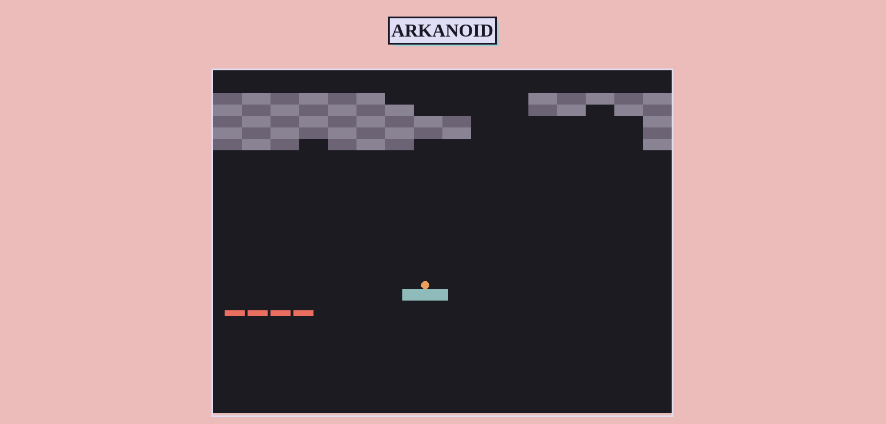

+++
title = "Project 01: Arkanoid"
date = 2025-05-03
draft = false
tags = ["C", "WASM", "Web Assembly", "Raylib"]

summary = "Arkanoid prject in C with raylib, compiled to WASM and hosted on github pages."
resources = [
  { src = "arkanoid.png", name = "cardimg" }
]
github_url = "https://github.com/Rococcoon/Arkanoid/"
github_live_url = "https://rococcoon.github.io/Arkanoid/"
+++

## Arkanoid

Built an Arkanoid-style game using Raylib, following a tutorial as a 
foundation. Focused on modularizing C code, improving structure, and gaining a 
deeper understanding of Raylib’s game lifecycle and render cycles. Implemented 
core mechanics like paddle movement, ball physics, and brick collision 
detection.

To make the game accessible on the web, I compiled it with Emscripten, 
converting the C code into WebAssembly. This allowed me to experiment with 
running native-like performance in the browser while learning about the 
nuances of WebAssembly and JavaScript interop. The project was a great 
introduction to game development, graphics programming, and optimizing C 
code for different platforms.
