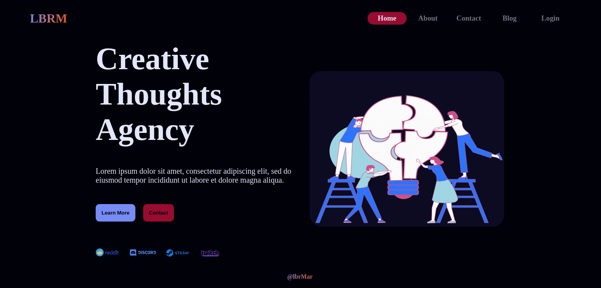

+++
title = "Project 02: Nextjs Fullstack Blog"
date = 2025-05-03
draft = false
tags = ["Javascript", "JS", "Nextjs"]

summary = "A full stack blog written in nextjs. Includes auth, mongodb."
resources = [
  { src = "next-fullstack-blog.png", name = "cardimg" }
]
github_url = "https://github.com/Rococcoon/nextjs-full-stack-blog/"
+++

## Nextjs Fullstack Blog

I built a full-stack blog using Next.js, MongoDB, and NextAuth for 
authentication, creating a modern and scalable web application. The blog 
features a clean and responsive UI, allowing users to browse, read, and 
interact with posts seamlessly. With server-side rendering (SSR) and static 
generation (SSG), the site delivers fast performance while maintaining dynamic 
functionality.

For user authentication, I integrated NextAuth, enabling secure sign-ins with 
provider GitHub, as well as email-based authentication. MongoDB serves as the 
database, efficiently storing and retrieving user-generated content. API 
routes in Next.js handle backend logic, making the application both performant 
and maintainable.

This project was an opportunity to refine my skills in full-stack development, 
from database design to frontend UI/UX. I focused on building a smooth user 
experience, role-based access control, and a dashboard for managing content. 
The result is a flexible and scalable blogging platform that can be extended 
with additional features in the future.
