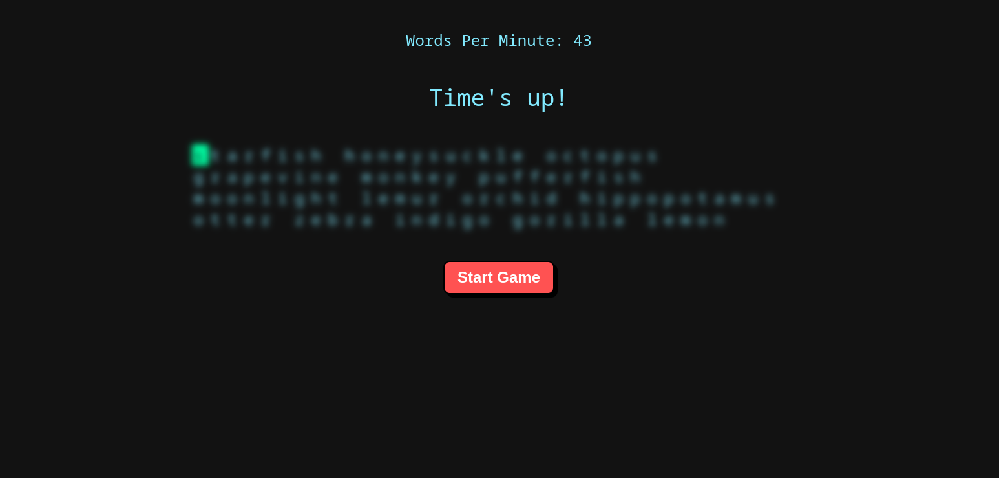

+++
title = "Project 03: Monkey Type Clone"
date = 2025-05-03
draft = false
tags = ["Javascript", "JS", "Web Components"]

summary = "Webcomponent type speed tester, based on monkey type."
resources = [
  { src = "type-tester.png", name = "cardimg" }
]
github_url = "https://github.com/Rococcoon/typeTester/"
github_live_url = "https://rococcoon.github.io/typeTester/"
+++

## Monkey Type Clone

I built a simple MonkeyType clone using Web Components, vanilla JavaScript, 
CSS, and HTML. This lightweight typing app runs entirely in the browser 
without any frameworks, keeping the codebase clean and efficient. It features 
smooth animations, real-time accuracy tracking, and a minimal UI for 
distraction-free typing practice.

This project was a fun experiment, inspired by my journey into touch typing 
on a split ergonomic keyboard. I wanted a custom typing tool to refine my 
skills while keeping the experience fast and intuitive. By focusing on pure 
web technologies, I ensured that the app remains highly responsive and works 
seamlessly across devices.

Beyond improving my typing speed, this project deepened my understanding of 
Web Components and modular frontend development. It’s a simple yet effective 
tool, and I may expand it with features like custom word lists, themes, and 
typing analytics in the future.
